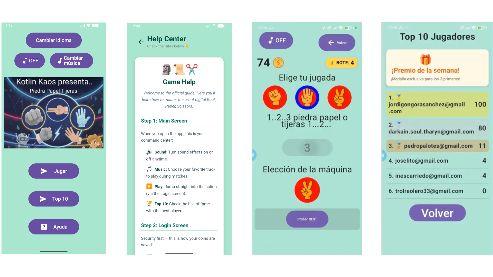

# Rock Paper Scissors — Extended Documentation

<p align="center">
  
</p>

This document provides the extended technical and functional documentation for the **Rock Paper Scissors** Android application, developed by the **Kotlin Kaos** team as an educational project for the course *Native Mobile Application Development*.

The goal of this project was to progressively build a mobile game using modern Android technologies while integrating cloud services and device features.

---

## Project Overview

Rock Paper Scissors is a classic game enhanced with modern mobile capabilities:

- User authentication
- Global ranking in real time
- Shared prize pool (global pot)
- Local persistence
- Multi-language support
- Background music
- Player location
- Victory registration in the device calendar
- Remote configuration of prize texts

The application was developed incrementally across several products, increasing complexity at each stage.

---

## Architecture

The project follows an **MVVM (Model–View–ViewModel)** architecture:

- **Model**: Data classes and repositories (Room entities, Firebase models)
- **View**: Jetpack Compose UI screens
- **ViewModel**: Business logic and state management using StateFlow

Main technologies:

- Kotlin
- Jetpack Compose
- Coroutines & Flow
- Room (SQLite)
- Firebase Authentication
- Cloud Firestore
- Firebase Remote Config

This separation improves maintainability, testability, and scalability.

---

## Local Database (Room / SQLite)

Room is used for local persistence:

- Player email/name
- Local scores
- Game state

This allows users to continue their progress even without network connectivity.

Key components:

- Entity: `Jugador`
- DAO: `JugadorDao`
- Database: `JugadoresDatabase`
- Repository layer

---

## Firebase Integration

Firebase provides the cloud functionality:

### Cloud Firestore

Used for:

- Global ranking (`jugadores` collection)
- Shared prize pool (`configuracion/bote` document)

Features:

- Real-time listeners for ranking updates
- Transactions for safe prize pool updates

### Firebase Remote Config

Used to remotely define:

- Prize title (`premio_titulo`)
- Prize description (`premio_descripcion`)

These values are loaded dynamically at app startup.

### Firebase Authentication

Used to identify users and associate scores securely.

Full setup instructions are available here:

- [Firebase Setup (English)](FIREBASE_SETUP_en.md)

---

## User Interface

The UI is fully implemented using **Jetpack Compose**:

- Declarative components (`Column`, `Row`, `Box`, `Text`, `Button`)
- Reactive state with StateFlow
- Preview support during development

No XML layouts are used.

---

## Game Features

### Gameplay

- Classic Rock–Paper–Scissors logic
- Randomized opponent choice
- Score calculation per round

### Ranking

- Top players displayed in real time
- Sorted by score descending
- Automatically updated via Firestore listeners

### Shared Prize Pool

- Points contribute to a global pot
- Atomic transactions prevent race conditions
- Players may claim the pot when conditions are met

---

## Audio

Background music is implemented using `MediaPlayer`:

- Starts automatically
- Releases resources correctly
- Uses Audio Focus to pause/resume when leaving or returning to the app

---

## Location

The app retrieves the player’s location using:

- `FusedLocationProviderClient`
- Coroutines (`suspend` functions)

Latitude and longitude are optionally stored in Firestore for each player.

---

## Calendar Integration

Victories can be registered in the device calendar:

- Permission is requested at runtime
- Events are inserted using `CalendarContract` and `ContentResolver`
- Includes date and win description

---

## Internationalization

The app supports multiple languages:

- English
- Spanish

Implementation:

- No hardcoded strings
- `strings.xml` files in `values` and `values-es`
- Text loaded via `stringResource()`

---

## Project Structure (Simplified)

```
app/
 ├── data/
 │   ├── dao/
 │   ├── model/
 │   ├── network/
 │   └── source/
 ├── repositorio/
 ├── viewmodel/
 └── ui/
```

---

## Educational Purpose

This repository is intended strictly for educational use.

It demonstrates:

- Modern Android development practices
- MVVM architecture
- Cloud integration
- Device services usage
- Collaborative teamwork

---

## Team

Developed by **Kotlin Kaos**:

- Gerard Melich  
- Jorge Gongora  
- Miguel Garzo  
- Raul Estevez  
- Xavier Pujol  

---

## Navigation

- Main README: [README.md](README.md)
- Firebase setup: [FIREBASE_SETUP_en.md](FIREBASE_SETUP_en.md)
- Dependencies: [DEPENDENCIES.md](DEPENDENCIES.md)
